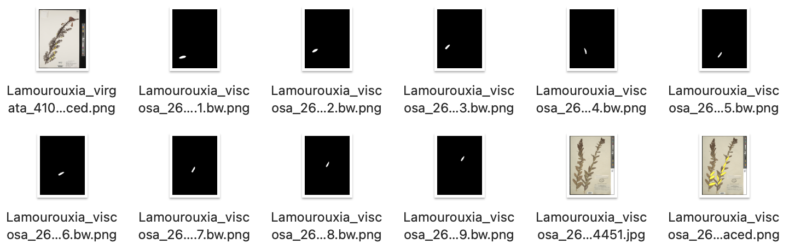
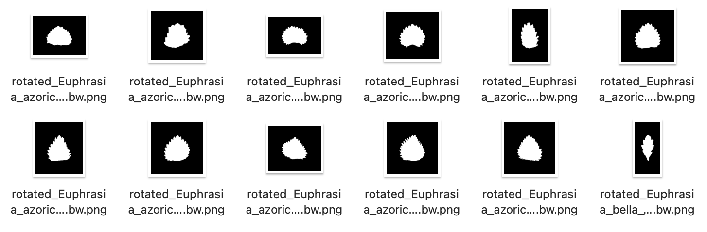

# Leaf outline analysis

These MatLab codes are intended to process RGB images of leaf to extract their outline and analyse it using EFD.

## I. Segment leaf outline from images of chemically cleared leaves

1. Place all images in one folder and execute `cleared_leaf_image_segmentation.m` in matlab to convert images to binary masks. This would create multiple black and white leaf segmentation per specimen and each representing an individual leaf.

  

2. Rotate the black-white mask to get dimension measurements
  
   - Place all images in a folder and call the function `batch_rotate_images(folder_path)` to rotate image. This function will write a rotated image `rotated_*` to the folder
   - Manual inspect the rotated leaves, heart shaped leaves can be tricky. Place these leaves need to be manually rotated in one folder and use `batch_rotate_images_manual(folder_path)`. This should generate a png file `rotated_*.png` where the main axis is placed vertically.
   - For dissected leaves, use the function `batch_rotate_dissected_leaf(folder_path)`, which will not fill holes.
   - Some images are upside down, they need to be manually sorted into one folder and use the following script to rotate the image for 180 degree.
```
image_files = dir(fullfile(folder_path, 'rotate*.png'));
for i = 1:numel(image_files)
	img = imread(fullfile(folder_path, image_files(i).name));
	% Rotate the image 180 degrees
	rotated_img = imrotate(img, 180, 'bilinear');
	imwrite(rotated_img,fullfile(folder_path, image_files(i).name))
```

In the end, this should create multiple `rotated_*.png` with leaf tip oriented upwards.

  

3. Once satisfied with the orientation of the leaf images, place them in one folder. Then measure the dimension of the leaves using the command `batch_dimension_measurement('folder_name')`.

This will generate a 'leaf_dimension' file with the following five metrics: 

```
Area = total leaf area in pixel
Length = vertital axis length in pixel
Width = horizontal axis length in pixel
Aspect ratio = width/length
Solidity = area/convex_hull
Ellipticalness Index = 4 * Area / (π * L * W)
Circularity = 4 * pi * area/parimeter^2
```
The outline coordinate `*.tsv` file is a list of x and y coordinates of the outline of the leaf. They can be used by Momocs (R package) for EFD analysis.


# II. Segment leaf outline from digitized specimens obtained from GBIF


To expand genus-level taxon sampling across Orobanchaceae as well as taxon-level sampling for several focal genera, we extracted leaf outline data from digitized specimens. 

1. Download Darwin Core database from GBIF using appropriate searching criteria (Clade = target and type = ‘preserved specimen', etc).
  
2. Unzip the downloaded folder, open the ‘multimedia.txt’ and filter the type to include only still images. Cross validate ‘multimedia.txt’ and ‘occurrence.txt’ to include species-level identification for selected species and multimedia data present.

3. Use `GBIF_prefilter.py` to generate URLs for batch download. This will generate a `download_url.sh` file that can be executed directly to obtain all digitized images. I found this batch downloading and local processing to be more efficient that repetitively access GBIF using GUI.

4. In Sketchbook, hand trace the outline of the leaf and use the [Flood Fill](https://help.sketchbook.com/en_US/Tools-overview/flood-fill) tool to speed up when possible. Desired leaf area should be colored yellow (R=255; G=255; B=0). Other color can be used but the matlab script in the following step for segmentation should be modified accordingly as well. Save the output to PNG file as show below.


  
5. Open each image in ImageJ and obtain the scale in pixels per millimeter.
  
6. Place all images in one folder and use `batch_specimen_leaf_segmentation.m` to segment individual leaves and obtain dimentional measurements. TO do so, in matlab type the following command:
```
batch_specimen_leaf_segmentation('working_folder')
```

7. Then follow the steps sbove to rotate the images.

# III. MISC: Fractal dimension as a measurement of leaf dissection

Initially I want to use the fractal dimension to quantify how 'dissected' a leaf is, but I found it not useful in my case. But for those who are interested, use the function `fractal_dimension` to calculate a value for each individual leaf image.
```
folder_path = 'path_to_images';
image_files = dir(fullfile(folder_path, 'rotate*.png'));
leaf_fd = ["ID" "fd"];
for i = 1:numel(image_files)
	curr_fd=fractal_dimension(fullfile(folder_path, image_files(i).name));
	leaf_fd = vertcat(leaf_fd, [image_files(i).name string(curr_fd)]);
end

filename = 'leaf_fractal_dimention.csv';
writematrix(leaf_fd, filename);

```
